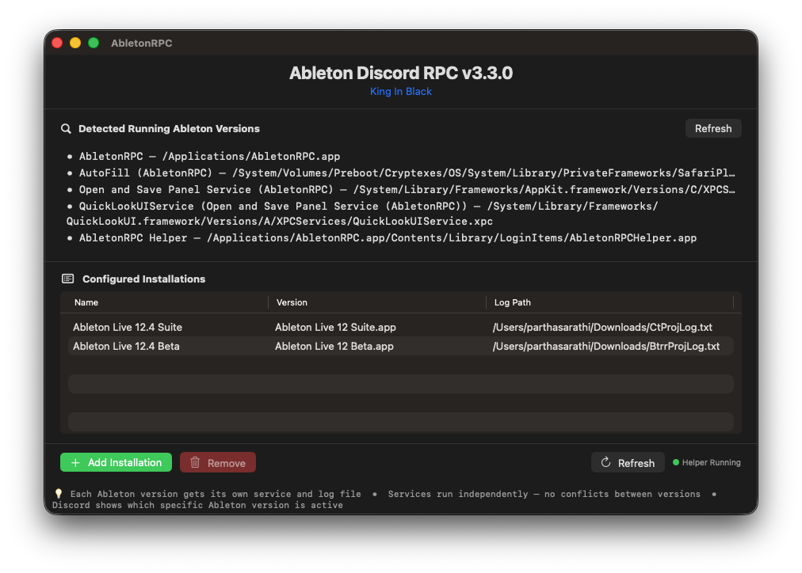
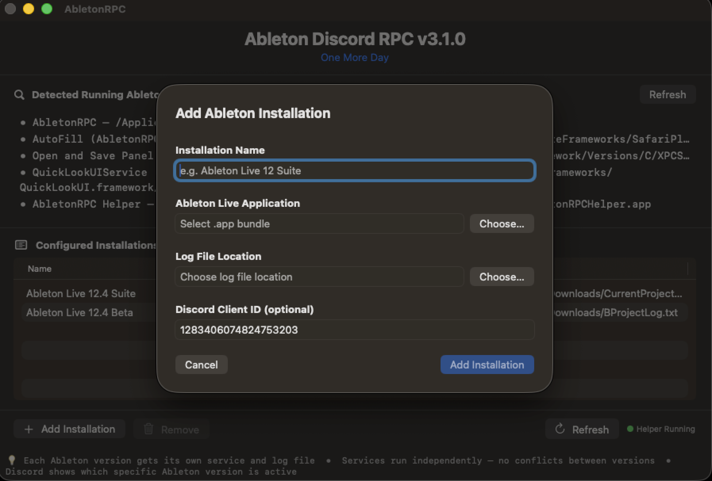

# AbletonRPC

<p align="center">
  
</p>

Unofficial Ableton Live Discord rich presence for macOS — powered by a native Swift app and a Python daemon.

## Main UI



## Disclaimer

AbletonRPC installs a small MIDI Remote Script (`FauxMIDI`) inside your Ableton Live application bundle. This modification is read-only from Ableton's perspective, does not touch any project files or preferences, and carries no risk of account ban or license revocation. That said, if you are not comfortable with it, stop here. This project is **unofficial** and is not affiliated with Ableton AG in any way.

Do not seek support for AbletonRPC in Ableton's official Discord or support channels.

---

## Requirements

- macOS 13 Ventura or later (tested on macOS 26 Tahoe)
- Ableton Live 11 or later (any edition)
- Discord desktop client (not the web app) — official client or Vesktop both work

Python is bundled inside the app — no separate installation required.

---

## Installation

### Using the pre-built app (recommended)

1. Download the latest release from the [Releases](https://github.com/KiwiSingh/AbletonRPC/releases) page
2. Unzip and move `AbletonRPC.app` to your Applications folder
3. Right-click → Open on first launch to bypass Gatekeeper
4. Click **Add Installation** and follow the setup flow

### Building from source

```bash
git clone https://github.com/KiwiSingh/AbletonRPC
cd AbletonRPC/AbletonRPC-GUI
./build.sh --install
```

`build.sh` handles everything: installs `xcodegen` via Homebrew, generates the Xcode project, builds the app, bundles the Python runtime, and copies it to `/Applications`. Xcode must be installed (Command Line Tools alone are not enough).

---

## Setup flow

1. Open AbletonRPC from your Applications folder
2. Click **Add Installation**

   

3. Give your installation a name, select your Ableton Live `.app` bundle, and choose a location for the log file (can be anywhere — an external drive works fine as long as it's connected when Ableton is running)

   

4. Click **Add Installation** — AbletonRPC installs the FauxMIDI script and registers the background helper automatically
5. **Restart Ableton Live twice** — once to fully unload any previously loaded FauxMIDI, and again to load the new one. Then go to **Preferences → MIDI** and set `FauxMIDI` as a Control Surface

   

6. Open Discord and start a session in Ableton — your rich presence will update automatically

---

## What shows in your presence

| Field | Example |
|-------|---------|
| Details | `My Long Project Na… — Kick Drum [MIDI]` |
| State | `Playing · 120 BPM · C# Minor · Compressor` |
| Large image tooltip | `Session View · Verse 2 · 7/8` |
| Small image | Loop on/off badge |
| Small image tooltip | `Loop active` / `Loop off` |

- **Details** — project name (word-boundary truncated if long) and selected track with type
- **State** — playback status, tempo, project key, and active device
- **Large image tooltip** — current view (Session/Arrangement), active scene name, time signature
- **Small image** — live loop indicator badge (requires `loop_on` and `loop_off` assets uploaded to your Discord Developer Portal)

All fields update live as you work — changing the key, switching scenes, toggling loop, or selecting a different track all fire immediately.

---

## How it works

```
macOS Login
  ↓
AbletonRPC Helper starts (via LaunchAgent)
  ↓
Helper launches one Python daemon per configured installation
  ↓
Daemon reads ~/Library/Application Support/AbletonRPC/installations.json
  ↓
FauxMIDI writes project name, tempo, state, key, time sig,
scene, loop, view, track, and device to a log file
  ↓
Daemon reads log file → updates Discord Rich Presence via pypresence
  ↓
Presence coordinator ensures only the active installation owns Discord
```

The helper is a native Swift app that manages the Python daemon's lifecycle — restarting it on crash and ensuring it always runs with the correct environment variables. Multiple installations (e.g. stable + beta) are coordinated by a priority system: Recording > Playing > Stopped.

---

## Multiple installations

AbletonRPC supports running multiple Ableton versions simultaneously (e.g. Live 11 and Live 12, or stable and beta). Each installation gets its own daemon process and log file. Discord will always show whichever version is actively recording or playing.

---

## Upgrading

### Clearing stale daemons (part of every upgrade)

After installing a new version, old daemon processes from the previous session may still be running and block the new ones. The correct order is:

1. Install the new version (`./build.sh --install` or replace the app)
2. Re-add your installations via the GUI
3. Restart Ableton once
4. Clear stale daemons — click **Clear Stale Daemons** in the app, or:
   ```bash
   pkill -f "ableton_rpc.py" 2>/dev/null
   rm -f ~/Library/Application\ Support/AbletonRPC/daemon-*.lock
   ```
5. Restart Ableton a second time

As of v4.0.0, daemons also self-heal stale locks on startup, but the manual clear after the first restart is still the most reliable approach.

### v3.3.0 → v4.0.0

Follow the upgrade order above. Re-add your installations to get the updated FauxMIDI script with view, loop, scene, and time signature support.

### v3.2.0 → v3.3.0

Follow the upgrade order above. Re-add installations to get key detection.

### v3.0.0 / v3.1.0 → v3.2.0+

Follow the upgrade order above for each step.

### v1.x / v2.x → v3.x+

A clean reinstall is required. Run the following to wipe the old install:

```bash
pkill -f "AbletonRPCHelper" 2>/dev/null
pkill -f "ableton_rpc.py" 2>/dev/null
rm -f ~/Library/LaunchAgents/com.kiwi.AbletonRPC*.plist
rm -f ~/Library/LaunchAgents/com.user.ableton-rpc.*.plist
rm -rf /Applications/AbletonRPC.app
rm -rf ~/Library/Application\ Support/AbletonRPC
rm -rf "/Applications/Ableton Live 12 Suite.app/Contents/App-Resources/MIDI Remote Scripts/FauxMIDI"
```

Then install the latest release and add your installations again.

---

## CLI usage

For those who prefer running the daemon directly:

```bash
cd AbletonRPC-GUI
pip install -r requirements.txt
python3 Resources/ableton_rpc.py --daemon <install_hash>
```

Find your install hash in `~/Library/Application Support/AbletonRPC/installations.json`. Add installations via the GUI first, then run the daemon from the CLI if preferred.

---

## Vesktop / alt-client support

AbletonRPC includes a custom IPC socket hunter (`BroadPresence`) that searches non-standard socket locations used by Vesktop, Legcord, WebCord, and other alternative Discord clients — in addition to the standard locations used by the official client.

---

## Frequently asked questions

**Q. Is this a port of [DAWRPC](https://github.com/Serena1432/DAWRPC)?**

No. Completely independent project built from scratch for macOS.

---

**Q. Will this mess up my Ableton installation?**

No. AbletonRPC only adds a `FauxMIDI` folder to Ableton's MIDI Remote Scripts directory. It does not modify any existing files. Removing the installation via the GUI cleans it up completely.

---

**Q. Will this affect my existing MIDI controllers or mappings?**

No. FauxMIDI is a passive observer — it only reads song state. It does not send or receive MIDI data and does not interfere with Push, MPK Mini, AKAI Fire, or any other controller.

---

**Q. My art assets aren't showing in Discord rich presence.**

Discord takes 10–60 minutes to propagate newly uploaded assets from the Developer Portal. Don't re-upload — just wait.

---

**Q. The loop badge isn't showing.**

Upload `loop_on.png` and `loop_off.png` to your Discord Developer Portal under **Rich Presence → Art Assets**, using exactly those filenames as the asset key names. Assets can take up to an hour to propagate.

---

**Q. The presence stopped working after updating AbletonRPC.**

Stale daemon processes from the previous version are likely still running. Click **Clear Stale Daemons** in the AbletonRPC app — it handles this in one click. Or from the terminal:

```bash
pkill -f "ableton_rpc.py" 2>/dev/null
rm -f ~/Library/Application\ Support/AbletonRPC/daemon-*.lock
```

The helper will relaunch everything automatically within a few seconds. As of v4.0.0, the daemon also detects and clears stale locks automatically on startup, so this should be much rarer going forward.

---

**Q. I re-added my installation but the presence still shows the old project name / no key / no scene.**

Restart Ableton twice — once to fully unload the old FauxMIDI script, and again to load the new one. Ableton doesn't always hot-swap MIDI Remote Scripts cleanly on a single restart.

---

**Q. The presence stopped working after I updated Ableton.**

Ableton updates sometimes replace the MIDI Remote Scripts folder. Open the AbletonRPC GUI, remove the installation, and add it again to reinstall FauxMIDI.

---

**Q. I upgraded Ableton via Rent-to-Own and the presence broke.**

Same fix as above — remove and re-add the installation in the GUI.

---

**Q. Track and device info isn't showing in my presence.**

Re-add your installation via the GUI so the latest FauxMIDI script gets installed, then restart Ableton twice.

---

**Q. Is this safe to use with Vesktop?**

Yes. See [Vesktop / alt-client support](#vesktop--alt-client-support) above.

---

**Q. Have you tested this with the latest Ableton version?**

Yes — tested with Ableton Live 12.4 Suite and 12.4 Beta on macOS 26 Tahoe.

---

**Q. Can I use my own Discord application / client ID?**

Yes. When adding an installation, replace the pre-filled Client ID with your own from the [Discord Developer Portal](https://discord.com/developers/applications). Make sure to upload your art assets there too.

---

**Q. Where can I reach you?**

Email: [kiwisingh@proton.me](mailto:kiwisingh@proton.me)  
Discord: `char1ot33r`
